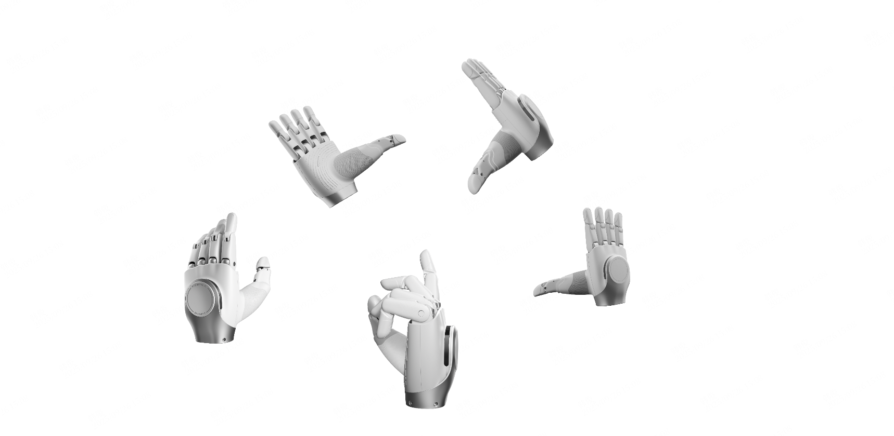
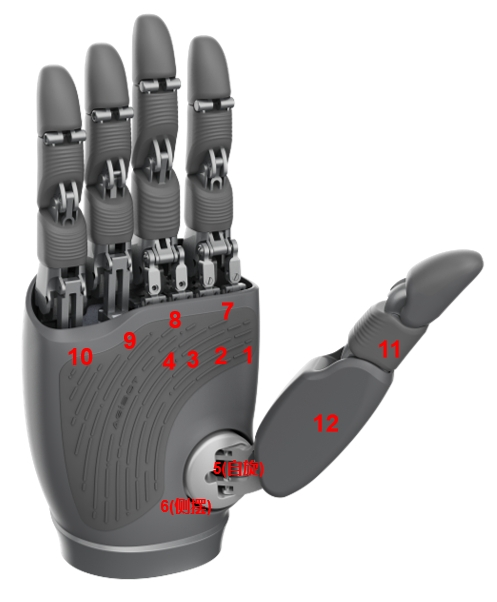

# OmniHand 2025 SDK v1.0.0 - Windows

支持的架构：x64

**平台说明**：本包为 Windows 版本。**ROS2 接口与 SocketCAN** 在 Windows 上不支持，仅在 Linux 平台提供。本包中的 API 文档（如 `doc/en/`、`doc/zh_cn/`）已去除与 ROS2 相关的内容，仅保留 Windows 可用接口说明。

## 产品概述

OmniHand 2025 SDK 支持三种产品型号：

**OmniHand 2025 灵动款 (O10)**：紧凑型高自由度交互灵巧手，具有 `10 个主动 + 6 个被动自由度`。重量仅 500g，采用 CANFD 通信接口，配备 `400+ 触觉点，0.1N 阵列分辨率，最大指尖力 5N`。适用于各种人形机器人和机械臂。其紧凑轻量化的设计和丰富的触觉交互能力，使其在交互服务、研究教育、轻量作业等领域具有重要价值。



**OmniHand Pro 2025 专业款 (O12)**：12 自由度专业灵巧手，具有精确操作和灵活控制能力。配备触觉传感器和多种控制模式（位置控制、力矩控制、混合控制），适用于研究教育、娱乐商业演出、展览引导、工业场景等多种应用。


**OmniHand Dex UMI (O10 UMI)**：使用 UMI 协议的只读灵巧手，支持周期性的位置和触觉传感器数据上报。

## 灵巧手电机索引

**OmniHand 2025 灵动款 (O10)**：具有 10 个自由度，索引从 1 到 10。对应的控制电机如下图所示：


**OmniHand Pro 2025 专业款 (O12)**：具有 12 个自由度，索引从 1 到 12。对应的控制电机如下图所示：



## 系统要求

### 硬件要求

支持以下通信接口：

- **CANFD (USB 适配器) - 推荐**：ZLG USBCANFD 系列（USBCANFD-100U-mini/USBCANFD-100U/USBCANFD-200U）
  - ✅ **零配置**：SDK 包含库文件，开箱即用
  - ✅ **无需管理员权限**：用户空间库
  - ✅ **简单 API**：`OmniHand2025.create_hand_by_zlgcan(...)` / `OmniHandPro2025.create_hand_by_zlgcan(...)` / `OmniHandDexUMI.create_hand_by_zlgcan(...)`
- **RS485（仅 OmniHand 2025）**：串口通信
- **Windows 不支持**：ROS2 接口与 SocketCAN 仅在 Linux 提供；本包内 API 文档已去除 ROS2 相关内容。

### 软件要求

- **操作系统**：Windows 10/11 (x64)
- **编译器**：MSVC 2019+ 或兼容版本
- **构建工具**：CMake 3.24 或更高版本（用于构建示例）
- **Python**：3.10 或更高版本（用于 Python SDK）

## 快速安装

以管理员身份运行：
``````
install.bat
``````

或指定路径：
``````
install.bat `"D:\omnihand2025`"
``````

## 卸载

以管理员身份运行：
``````
uninstall.bat
``````

## 目录结构

``````
windows/
├── cpp/
│   ├── share/
│   │   └── cmake/
│   │   └── omnihand/        # CMake 配置
│   ├── include/omnihand/         # 头文件
│   ├── lib/                      # C++ 库
│   ├── demo/                      # C++ 示例源码（不安装）
│   │   ├── omnihand_2025/
│   │   ├── omnihand_pro_2025/
│   │   └── omnihand_dex_umi/
│   ├── test/                      # C++ 测试源码（不安装）
│   └── bin/omnihand/
│       ├── demo/                  # 示例可执行文件
│       └── test/                   # 测试可执行文件
├── python/
│   ├── *.whl                     # Python wheel
│   ├── demo/                     # Python 示例（不安装）
│   │   ├── omnihand_2025/
│   │   ├── omnihand_pro_2025/
│   │   └── omnihand_dex_umi/
│   └── test/                      # Python 测试（不安装）
├── doc/                          # 文档
├── install.bat                   # 安装脚本
├── uninstall.bat                 # 卸载脚本
├── README.md                     # [English Documentation](README.md)
└── README_zh_cn.md               # 本文档（中文）
``````

## C++ 使用

``````cmake
set(OMNIHAND_ROOT "C:/Program Files/omnihand2025")
list(APPEND CMAKE_MODULE_PATH `"`${OMNIHAND_ROOT}/share/cmake/omnihand`")
find_package(omnihand REQUIRED)
target_link_libraries(your_target omnihand)  # 统一库支持 OmniHand 2025 (O10)、OmniHand Pro 2025 (O12) 和 OmniHand Dex UMI (O10 UMI)
``````

C++ 示例代码（推荐：ZLG USB CANFD - 零配置）：

``````cpp
#include "omnihand/omnihand_2025.h"  // 用于 OmniHand 2025 (O10)
// #include "omnihand/omnihand_pro_2025.h"  // 用于 OmniHand Pro 2025 (O12)

int main() {
    // OmniHand 2025 (O10, 10 DOF) - 推荐：ZLG USB CANFD
    //   hand_type    = EHandType::eLeft      // 左手或右手
    //   device_id    = 1                     // 写入灵巧手固件的设备 ID
    //   canfd_id     = 0                     // USB CANFD 适配器索引
    //   channel_id   = 0                     // 该适配器上的 CAN 通道索引
    auto hand = OmniHand2025::createHandByZlgcan(EHandType::eLeft, 1, 0, 0);

    if (!hand || !hand->Init()) {
        std::cerr << "初始化失败" << std::endl;
        return -1;
    }

    // 设置所有关节角度（推荐：求解器自动转换为电机位置）
    std::vector<double> angles(10, 0.0);  // 10 个关节，全部设置为 0 弧度
    hand->SetAllActiveJointAngles(angles);

    return 0;
}
``````

更多示例，请参阅 [cpp/demo/](cpp/demo/) 目录，包含产品特定的子目录。

详细的 C++ API 说明，请参阅 [doc/zh_cn/API_CPP.md](doc/zh_cn/API_CPP.md) - 包含产品特定 API 链接的索引页：
- [OmniHand 2025 (O10) C++ API](doc/zh_cn/API_CPP_O10.md)
- [OmniHand Pro 2025 (O12) C++ API](doc/zh_cn/API_CPP_O12.md)
- [OmniHand Dex UMI (O10 UMI) C++ API](doc/zh_cn/API_CPP_O10_UMI.md)

## Python 使用

``````python
# 推荐：ZLG USB CANFD（零配置）
from omnihand import OmniHand2025, OmniHandPro2025, EHandType

# OmniHand 2025 (10 DOF)
hand_o10 = OmniHand2025.create_hand_by_zlgcan(
    hand_type=EHandType.RIGHT,
    hand_device_id=1,
    canfd_device_id=0,
    canfd_channel_id=0
)

if not hand_o10.init():
    print("初始化失败")
    exit(1)

# OmniHand Pro 2025 (12 DOF)
hand_o12 = OmniHandPro2025.create_hand_by_zlgcan(
    hand_type=EHandType.LEFT,
    hand_device_id=1,
    canfd_device_id=0,
    canfd_channel_id=0
)
``````

更多示例，请参阅 [python/demo/README.md](python/demo/README.md)。

详细的 Python API 说明，请参阅 [doc/zh_cn/API_PYTHON.md](doc/zh_cn/API_PYTHON.md) - 包含产品特定 API 链接的索引页：
- [OmniHand 2025 (O10) Python API](doc/zh_cn/API_PYTHON_O10.md)
- [OmniHand Pro 2025 (O12) Python API](doc/zh_cn/API_PYTHON_O12.md)
- [OmniHand Dex UMI (O10 UMI) Python API](doc/zh_cn/API_PYTHON_UMI.md)

## 许可证

Mulan PSL v2 - Copyright (c) 2025, Agibot Co., Ltd.
